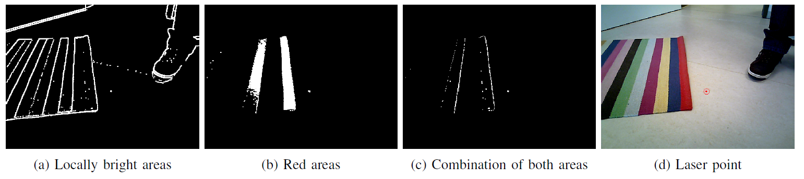

## pointer_detection

This package provides ROS nodes for the detection and localization of laser spots on the ground plane. The algorithm does not require a certain color of the laser spot, but it should be significantly brighter than its surrounding. There are two variants of the detection and localization algorithm:

1. The location of the laser spot w.r.t. the camera coordinate frame is determined using an additional depth sensor. Thus, this method is intended to be used on mobile platforms with a RGB-D sensor (node: pointer_localizer_robot).
2. The location of the laser spot w.r.t. the camera coordinate frame is determined using a ground plane model assuming a static camera pose. Thus, no additional depth sensor is necessary.  In order to work, the camera's transformation w.r.t. the global coordinate frame needs to be known. This method is intended to be used on static cameras integrated into smart environments (node: pointer_localizer_ie).

In both cases, the camera intrinsic parameters need to be known to work properly.



### Nodes

1. **pointer_localizer_robot**

   - Subscribed topics:

     /camera/rgb/image_raw ([sensor_msgs/Image](http://docs.ros.org/api/sensor_msgs/html/msg/Image.html))

     /camera/depth_registered/image_raw ([sensor_msgs/Image](http://docs.ros.org/api/sensor_msgs/html/msg/Image.html))

     /camera/rgb/camera_info ([sensor_msgs/CameraInfo](http://docs.ros.org/api/sensor_msgs/html/msg/CameraInfo.html))

   - Published topics

      /pointer_image ([sensor_msgs/Image](http://docs.ros.org/api/sensor_msgs/html/msg/Image.html))

      /pointing_point ([geometry_msgs/PointStamped](http://docs.ros.org/api/geometry_msgs/html/msg/PointStamped.html))

   - Parameters

      ~input_rgb_topic (string, default: "/camera/rgb/image_raw")

      ~input_depth_topic (string, default: "/camera/depth_registered/image_raw")

      ~rgb_camera_info_topic (string, default: "/camera/rgb/camera_info")

2. **pointer_localizer_ie**

   - Subscribed topics:

     /camera/rgb/image_raw ([sensor_msgs/Image](http://docs.ros.org/api/sensor_msgs/html/msg/Image.html))

     /camera/rgb/camera_info ([sensor_msgs/CameraInfo](http://docs.ros.org/api/sensor_msgs/html/msg/CameraInfo.html))

   - Published topics

     /pointer_image ([sensor_msgs/Image](http://docs.ros.org/api/sensor_msgs/html/msg/Image.html))

     /pointing_point ([geometry_msgs/PointStamped](http://docs.ros.org/api/geometry_msgs/html/msg/PointStamped.html))

   - Parameters

     ~input_rgb_topic (string, default: "/camera/rgb/image_raw")

     ~rgb_camera_info_topic (string, default: "/camera/rgb/camera_info")


### License
The package is released under the terms of BSD 3-Clause. For full terms and conditions, see the [LICENSE](../LICENSE) file.

### Reference
More details can be found in the following paper: 

D. Sprute, K. Tönnies, and M. König, “This Far, No Further: Introducing Virtual Borders to Mobile Robots Using a Laser Pointer,” in *2019 Third IEEE International Conference on Robotic Computing (IRC)*, 2019, p. 403–408 ([Link](https://arxiv.org/abs/1708.06274))

```
@inproceedings{sprute:2019a,
	author = {Dennis Sprute and Klaus T{\"o}nnies and Matthias K{\"o}nig},
	title = {This Far, No Further: Introducing Virtual Borders to Mobile Robots Using a Laser Pointer},
	booktitle={2019 Third IEEE International Conference on Robotic Computing (IRC)},
	year = {2019},
	pages={403--408}
}
```
